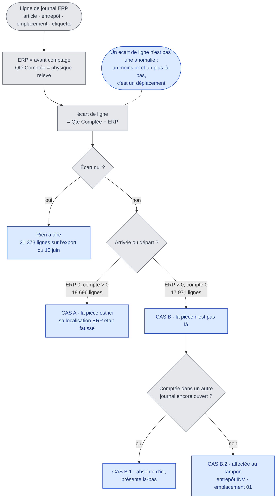
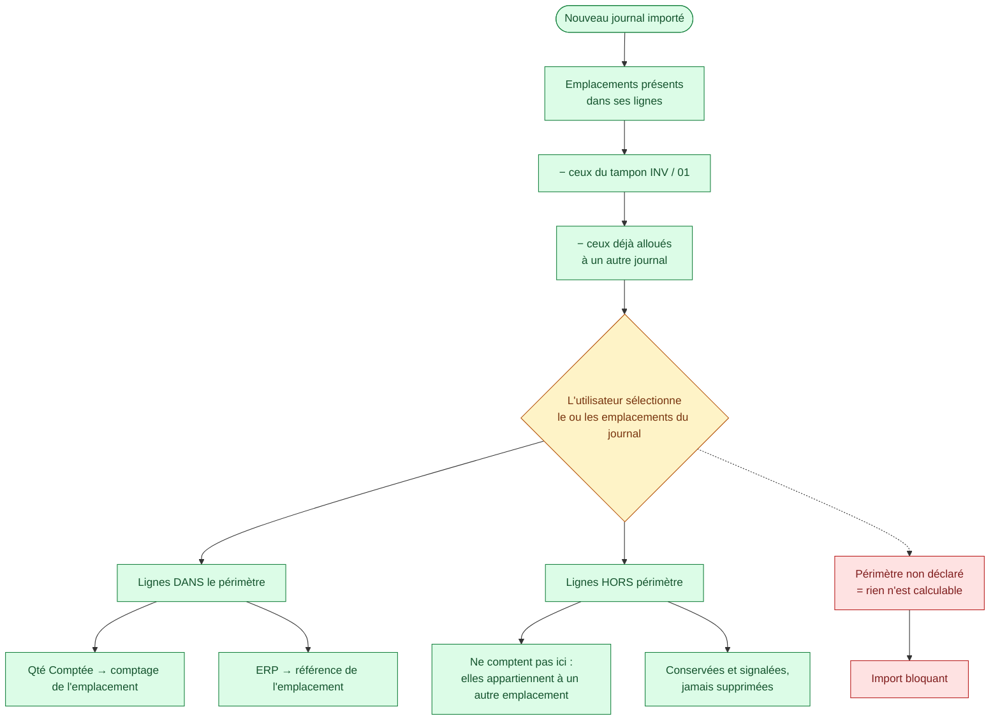
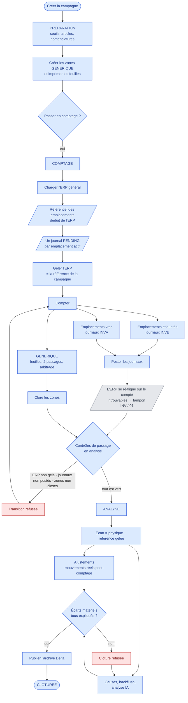
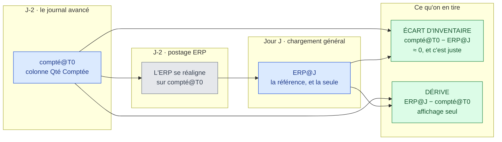
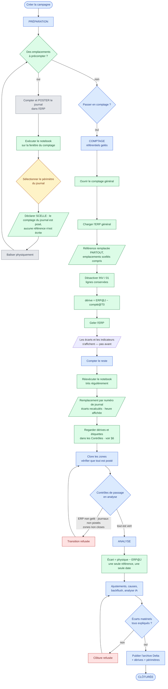
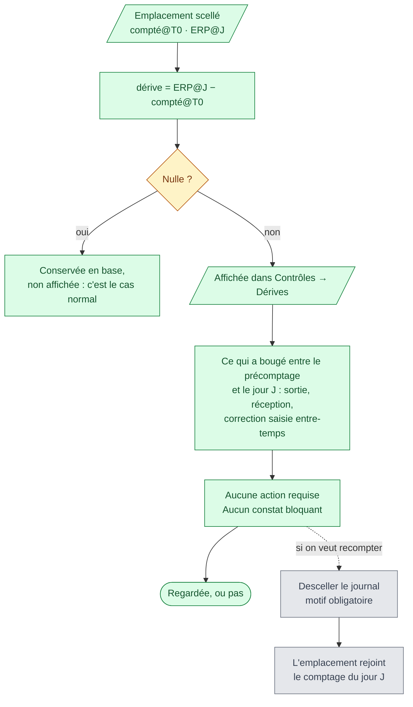
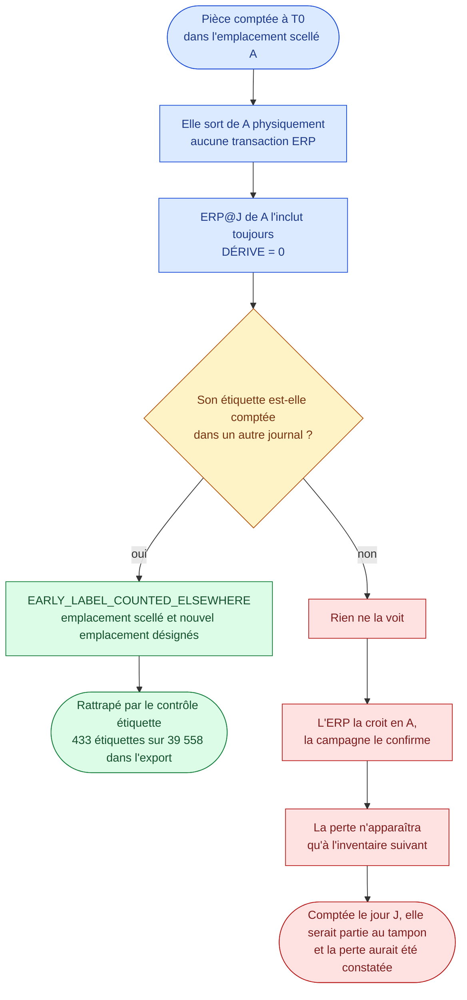
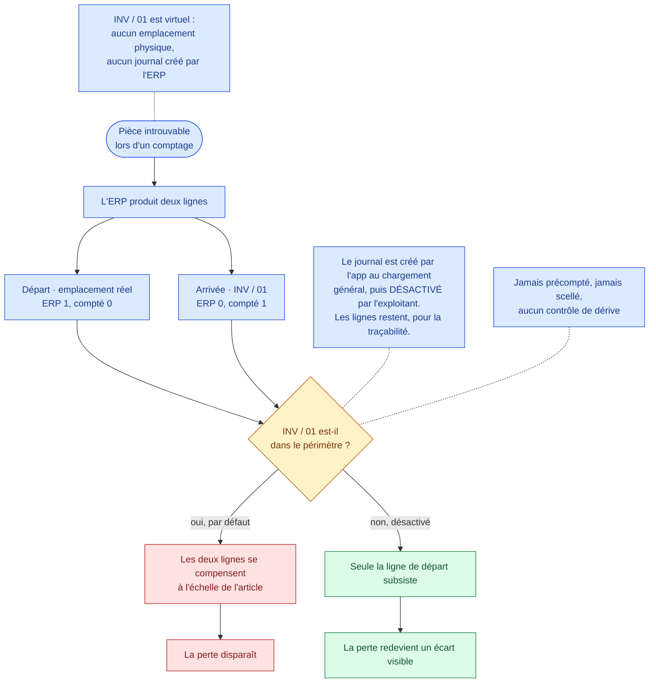
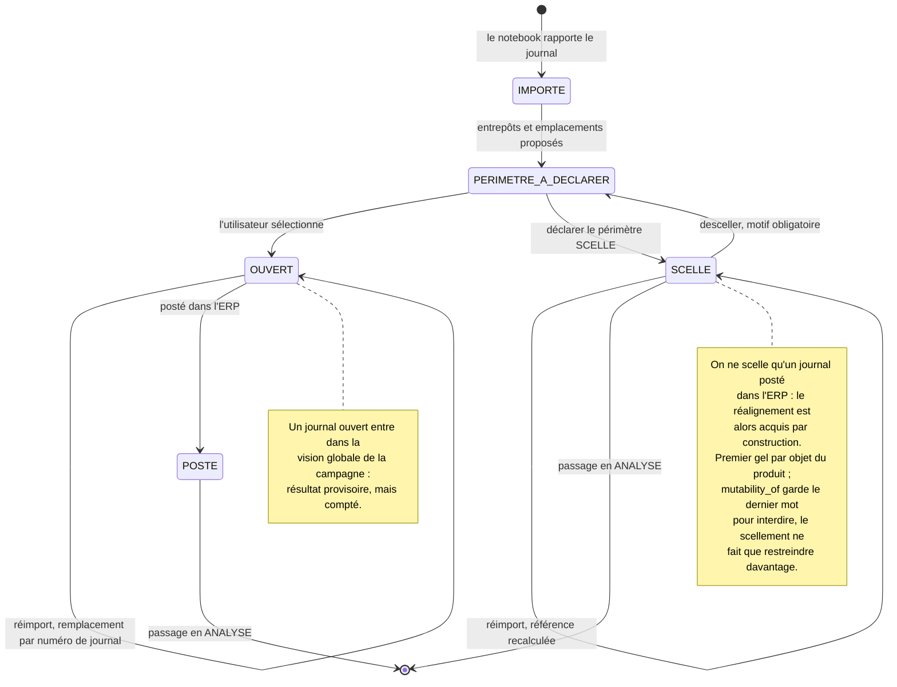

# Algorigrammes

Le processus d'inventaire avant les **comptages avancés**, puis tel qu'il
fonctionne depuis. La logique est décrite dans
[`07-comptages-avances.md`](07-comptages-avances.md), le mode d'emploi dans le
[guide utilisateur](04-guide-utilisateur.md).

Les diagrammes sont en Mermaid : ils se lisent tels quels dans GitHub et dans la
plupart des éditeurs Markdown.

Convention de couleur, la même partout :

- **bleu** — étape existante, inchangée ;
- **vert** — étape nouvelle, apportée par les comptages avancés ;
- **rouge** — point de blocage, ou perte d'information ;
- **jaune** — décision humaine ;
- **gris** — geste hors application : balisage physique, mécanique interne de
  l'ERP.

Notation des quantités :

| Symbole | Quantité |
|---|---|
| `compté@T0` | Colonne « Qté Comptée » du journal avancé, agrégée sur son périmètre |
| `ERP@J` | Snapshot ERP général, gelé le jour J — **la référence, et la seule** |

> `ERP@T0` — la colonne « Stock ERP » du journal avancé — a été une référence
> dans une version précédente. Elle ne l'est plus : le journal est posté dans
> l'ERP avant que la photo du jour J ne soit prise, donc la photo l'intègre déjà,
> et mesurer contre l'état antérieur comptait deux fois la même correction.

---

## 1. Ce que contient une ligne de journal ERP

Le journal porte sa propre référence : chaque ligne donne à la fois l'ERP d'avant
comptage et le compté.

---

## 2. Le périmètre d'un journal se déclare

Un journal appartient à un seul entrepôt mais couvre plusieurs emplacements — 48
sur 73 dans l'export, jusqu'à 54 pour l'un d'eux. Et les emplacements de ses
lignes ne suffisent pas à dire lesquels il couvre : certaines lignes ne sont là
que pour matérialiser un déplacement.

---

## 3. Le processus actuel

**Ce que ce schéma montre du problème.** Le gel de la référence (`I`) précède
tout comptage, et les journaux naissent du chargement (`F → H`), un par
emplacement. Il n'existe aucun point de ce parcours où compter un emplacement
avant la photo générale — ni aucune place pour un journal ERP qui en couvre
cinquante.

---

## 4. Les deux quantités dans le temps

**Le point clé : l'ERP se réaligne avant la photo.** Poster le journal du
précomptage inscrit sa correction dans l'ERP, et la photo du jour J la reprend.
La référence est donc unique pour tout le monde :

| Emplacement | Référence |
|---|---|
| Ordinaire | `ERP@J` |
| Précompté et scellé | `ERP@J` — la même, parce que la photo a déjà intégré son précomptage |

**Conséquence, et il faut l'annoncer** : l'écart d'un emplacement précompté vaut
zéro dans le cas nominal, et c'est exact. Le résultat de son inventaire n'est
pas perdu — il a été enregistré plus tôt, dans l'ERP, avant la campagne. Plus on
précompte, meilleur est l'IRA de la campagne, et c'est la vérité de ce qu'elle
mesure : ce qui restait à corriger le jour J.

C'est aussi pourquoi **rien ne s'affiche avant le gel** : un écart a besoin
d'une référence, et elle arrive le jour J.

---

## 5. Le processus avec comptages avancés

---

## 6. La dérive : une quantité, aucune issue

Aucune issue, là où il y en avait deux — *conserver le comptage avancé* et
*recompter le jour J* — et quatre avant elles. Les quatre reposaient sur la même
prémisse : qu'un emplacement scellé porte sa propre référence, et qu'il faille
arbitrer entre deux vérités. Cette prémisse est tombée avec `ERP@T0`.

Ce qui reste existe toujours, à sa place, et se déclenche pour ses raisons
propres : le **descellement** pour un emplacement qu'on veut recompter, la
colonne d'**ajustement** pour un mouvement réel.

---

## 7. Ce que la dérive ne voit pas, et ce que l'étiquette rattrape

La dérive se calcule entre deux lectures de l'ERP : elle ne voit que ce que l'ERP
a appris.

C'est le seul contrôle du dispositif qui descende au grain de l'étiquette, et
c'est ce qui justifie de remonter `SILlabelID` dans l'application. Reste la
branche de droite : le précomptage échange une part de pouvoir de détection
contre de la charge en moins, et seule la durée de la fenêtre T0 → J en règle
l'ampleur.

---

## 8. `INV / 01`, le tampon

L'ERP concentre les pertes dans un emplacement, l'application les laisse là où
elles ont été constatées. La désactivation est ce qui fait le pont entre les deux
représentations — d'où son caractère obligatoire.

---

## 9. Cycle de vie d'un journal de comptage

