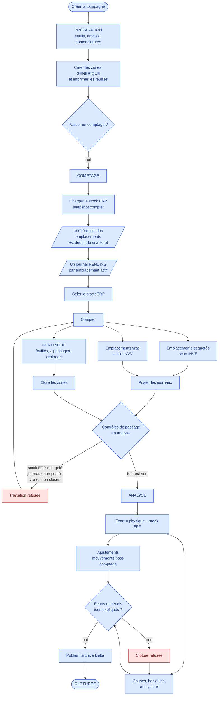
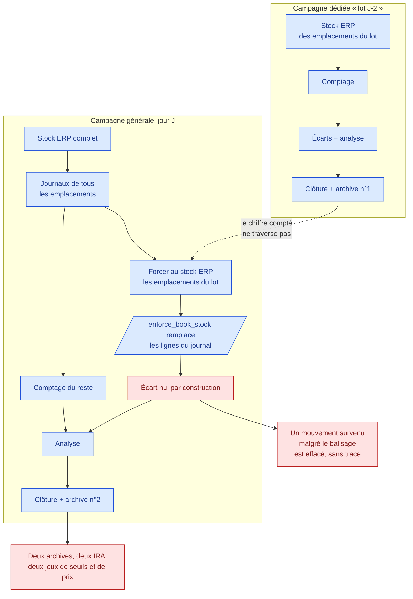
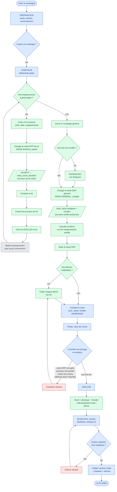
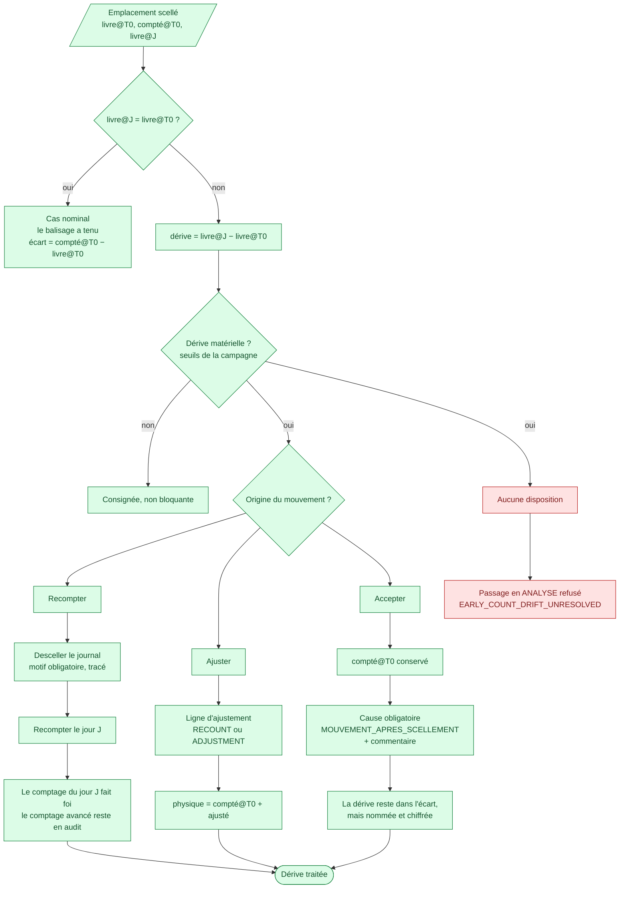
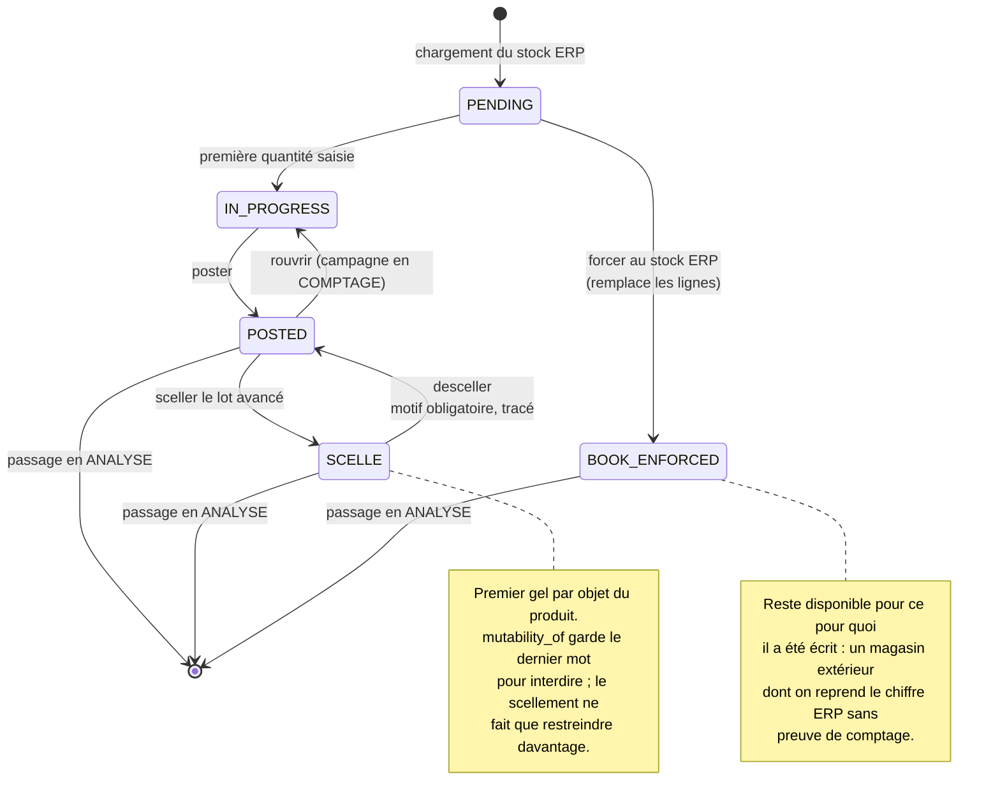
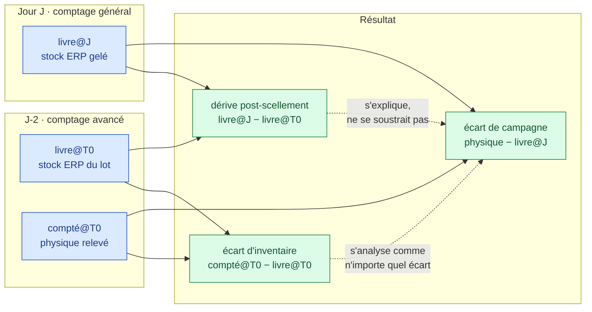

# Algorigrammes

Le processus d'inventaire tel qu'il fonctionne aujourd'hui, puis tel qu'il
fonctionnerait avec les **comptages avancés** décrits dans
[`07-comptages-avances.md`](07-comptages-avances.md).

Les diagrammes sont en Mermaid : ils se lisent tels quels dans GitHub et dans la
plupart des éditeurs Markdown.

Convention de couleur, la même partout :

- **bleu** — étape existante, inchangée ;
- **vert** — étape nouvelle, apportée par les comptages avancés ;
- **rouge** — point de blocage, la campagne n'avance pas tant qu'il n'est pas
  levé ;
- **gris** — geste hors application (balisage physique, comptage papier).

---

## 1. Le processus actuel



**Ce que ce schéma montre du problème.** Les journaux naissent du chargement du
stock ERP (`F → H`), et ce chargement est unique et complet. Il n'existe donc
aucun point, dans ce parcours, où l'on puisse compter un emplacement avant que la
photo générale ait été prise.

---

## 2. Le contournement possible aujourd'hui, et ce qu'il perd



---

## 3. Le processus avec comptages avancés



---

## 4. Le traitement d'une dérive

C'est la seule décision vraiment nouvelle demandée à l'exploitant. Elle se prend
ligne par ligne — un article, un emplacement.



**Pourquoi une décision humaine et non un calcul.** Un mouvement informatique
seul (régularisation, saisie tardive) et un mouvement physique réel produisent
la même trace dans l'ERP, y compris dans le miroir `erp_mouvements` : même
forme, même quantité, même date. Le choix de la branche `E` ne peut pas être
déduit des données.

Les deux cas sans ligne en face suivent le même parcours : un article **apparu**
dans `livre@J` a `livre@T0 = 0` et `compté@T0 = 0` ; un article **disparu** a
`livre@J = 0`. C'est pourquoi le rapprochement doit être une jointure externe
complète, pas une jointure interne.

---

## 5. Cycle de vie d'un journal de comptage

À gauche l'existant, à droite ce que le scellement ajoute.



---

## 6. Les trois quantités, vues comme un flux



L'égalité qui doit rester vraie, et qui est la raison de conserver `livre@T0` :

```
écart de campagne = écart d'inventaire − dérive + ajustements
```

Si `livre@T0` n'est pas conservé, seul le membre de gauche est calculable, et un
écart d'inventaire de +10 masqué par une dérive de +10 s'affiche à zéro.
