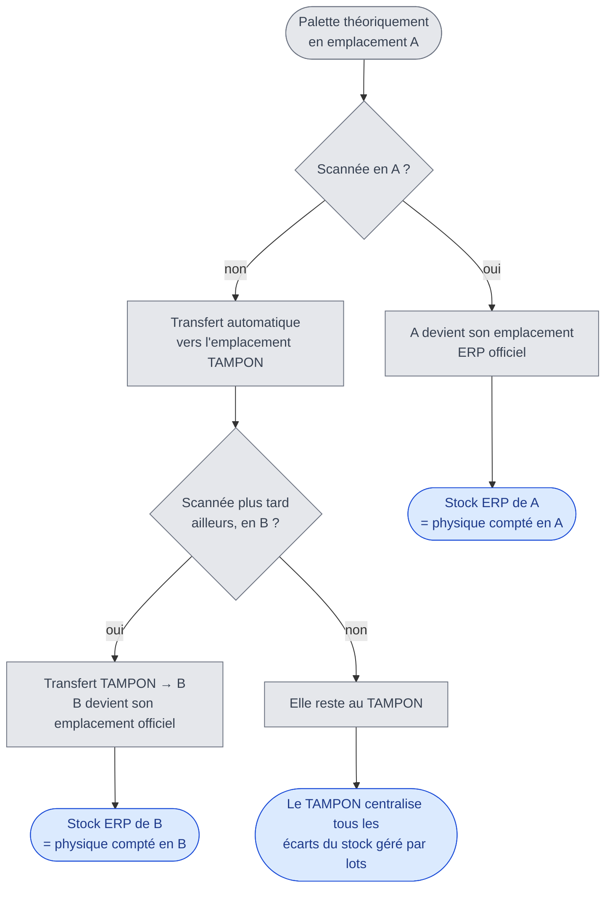
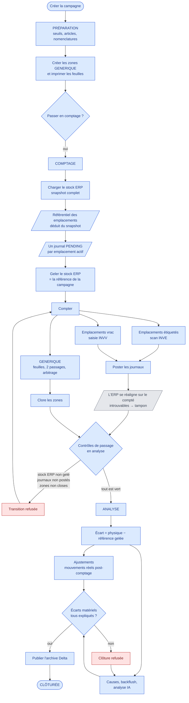
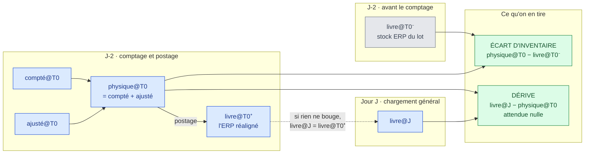
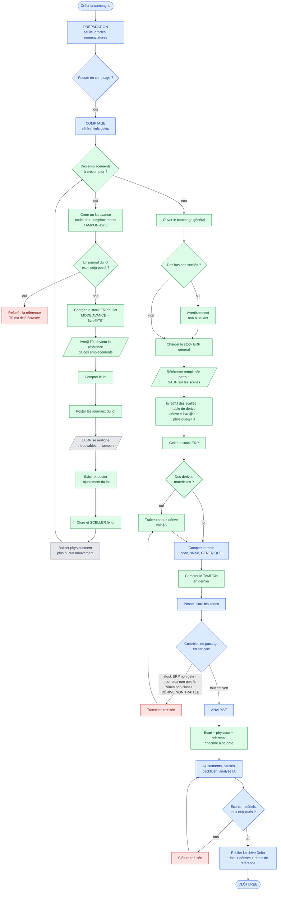
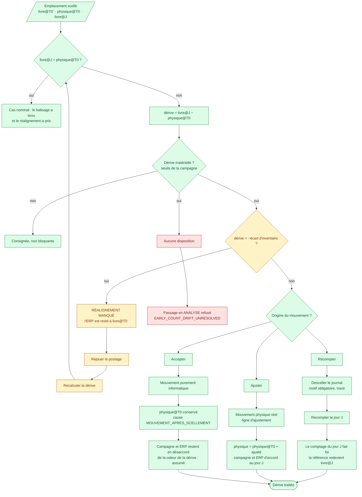
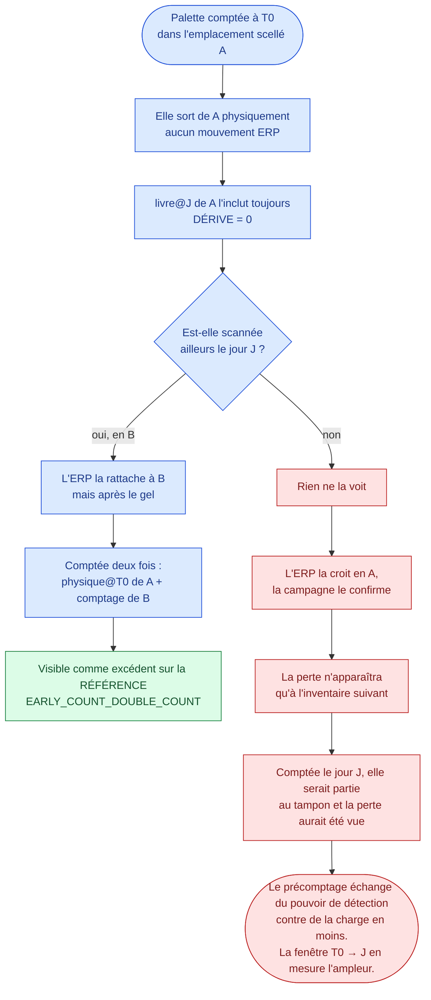
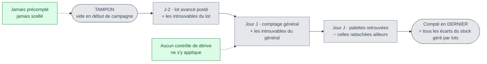

# Algorigrammes

Le processus d'inventaire tel qu'il fonctionne aujourd'hui, puis tel qu'il
fonctionnerait avec les **comptages avancés** décrits dans
[`07-comptages-avances.md`](07-comptages-avances.md).

Les diagrammes sont en Mermaid : ils se lisent tels quels dans GitHub et dans la
plupart des éditeurs Markdown.

Convention de couleur, la même partout :

- **bleu** — étape existante, inchangée ;
- **vert** — étape nouvelle, apportée par les comptages avancés ;
- **rouge** — point de blocage, ou perte d'information ;
- **gris** — geste hors application : balisage physique, mécanique interne de
  l'ERP.

Notation des quantités :

| Symbole | Quantité |
|---|---|
| `livre@T0⁻` | Stock ERP **avant** postage du journal avancé — la référence |
| `compté@T0` | Physique relevé au comptage avancé |
| `ajusté@T0` | Ajustements saisis à T0 |
| `physique@T0` | `compté@T0 + ajusté@T0`, et donc `livre@T0⁺` après réalignement |
| `livre@J` | Stock ERP du snapshot général gelé le jour J |

---

## 1. Ce que fait un journal de comptage

C'est la mécanique qui commande tout le reste : poster un journal ne consigne pas
un écart, il **réaligne l'ERP sur le physique compté**. Vu palette par palette :

**Ce qu'il faut en retenir :** après postage, le stock ERP d'un emplacement vaut
le physique qui y a été compté. C'est de là que découle l'attendu du jour J —
`livre@J = physique@T0`, et non `livre@J = livre@T0⁻`.

---

## 2. Le processus actuel

**Ce que ce schéma montre du problème.** Le gel de la référence (`I`) précède
tout comptage, et les journaux naissent du chargement (`F → H`). Il n'existe donc
aucun point de ce parcours où compter un emplacement avant que la photo générale
n'ait été prise.

---

## 3. Les quatre quantités dans le temps

Le cœur de la conception. À lire de gauche à droite.

**La règle qui en découle**, et qui est déjà celle du code — la référence est
*ce contre quoi la campagne a été comptée* :

| Emplacement | Référence de l'écart |
|---|---|
| Ordinaire | `livre@J` — rien n'était compté quand la photo a été prise |
| Précompté et scellé | `livre@T0⁻` — c'est contre lui que le comptage a eu lieu |

Sans cette règle, l'écart d'un emplacement précompté vaudrait
`physique@T0 − livre@J`, c'est-à-dire **zéro** dans le cas nominal : le résultat
de l'inventaire disparaîtrait, et l'IRA tendrait vers 100 % à mesure qu'on
précompte.

---

## 4. Le processus avec comptages avancés

---

## 5. Le traitement d'une dérive

La seule décision réellement nouvelle demandée à l'exploitant. Elle se prend
ligne par ligne — un article, un emplacement.

**Pourquoi une décision humaine.** Un mouvement informatique seul, un prélèvement
réel et la correction d'un mauvais scan produisent la même trace dans l'ERP — même
type, même quantité, même date — y compris dans le miroir `erp_mouvements`. Seule
la branche jaune se déduit : une dérive exactement opposée à l'écart d'inventaire
signifie que l'ERP est resté où il était, donc que le postage n'a pas pris.

---

## 6. Ce que la dérive ne verra pas

La limite honnête du dispositif. Elle se lit en suivant une palette sortie d'un
emplacement scellé **sans aucune transaction ERP**.

Aucune écriture de code ne rattrape la branche de droite : seul le balisage
physique le fait. C'est un argument pour des fenêtres courtes et pour réserver le
précomptage aux emplacements réellement immobilisés.

---

## 7. L'emplacement tampon dans le temps

Le tampon agrège les manquants de tous les emplacements : la lecture **par
emplacement** en devient structurellement trompeuse — un emplacement scellé
paraît juste, le tampon paraît catastrophique, alors qu'il ne s'agit que d'un
déplacement d'écriture. L'application a déjà tranché ce point, et l'écran
d'analyse s'ouvre sur la lecture par référence :

> L'écart vu par emplacement compte deux fois une palette déplacée. La différence
> avec l'écart par référence mesure exactement cette part-là.

Le précomptage ne change pas cette conclusion, il la renforce.

---

## 8. Cycle de vie d'un journal de comptage

```mermaid
stateDiagram-v2
    [*] --> PENDING : chargement du stock ERP

    PENDING --> IN_PROGRESS : première quantité saisie
    IN_PROGRESS --> POSTED : poster, et l'ERP se réaligne
    POSTED --> IN_PROGRESS : rouvrir, campagne en COMPTAGE
    PENDING --> BOOK_ENFORCED : forcer au stock ERP

    POSTED --> SCELLE : sceller le lot avancé
    SCELLE --> POSTED : desceller, motif obligatoire

    POSTED --> [*] : passage en ANALYSE
    SCELLE --> [*] : passage en ANALYSE
    BOOK_ENFORCED --> [*] : passage en ANALYSE

    note right of SCELLE
        Premier gel par objet du produit.
        mutability_of garde le dernier mot
        pour interdire ; le scellement ne
        fait que restreindre davantage.
    end note

    note right of BOOK_ENFORCED
        Force compté := livre@J.
        Détruit la référence, donc le
        résultat de l'inventaire, et
        absorbe la dérive sans un mot.
        Reste juste pour ce pour quoi il
        a été écrit : un magasin extérieur
        dont on reprend le chiffre ERP
        sans preuve de comptage.
    end note
```

